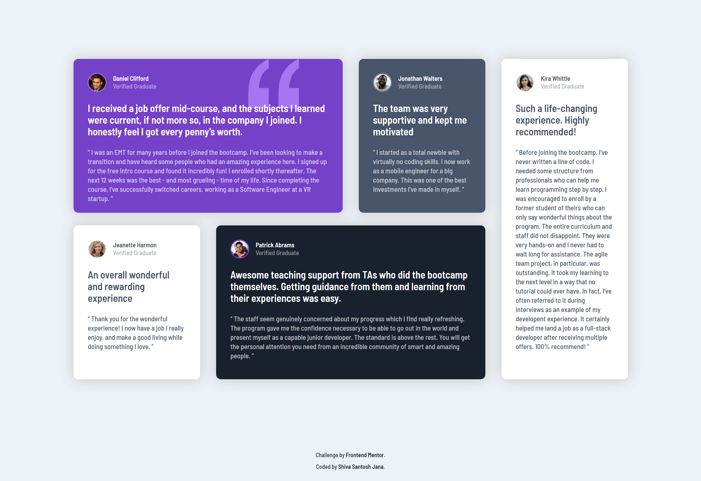

# Frontend Mentor - Testimonials grid section solution

This is a solution to the [Testimonials grid section challenge on Frontend Mentor](https://www.frontendmentor.io/challenges/testimonials-grid-section-Nnw6J7Un7). Frontend Mentor challenges help you improve your coding skills by building realistic projects.

## Table of contents

- [Overview](#overview)
  - [The challenge](#the-challenge)
  - [Screenshots](#screenshots)
  - [Links](#links)
- [My process](#my-process)
  - [Built with](#built-with)
  - [Continued development](#continued-development)
- [Author](#author)

## Overview

### The challenge

Users should be able to:

- View the optimal layout for the site depending on their device's screen size

### Screenshots

Desktop version

Mobile version

### Links

- Solution URL: [Code on GitHub](https://github.com/santu369/frontendmentor-testimonials-grid-section)
- Live Site URL: [GitHub Pages Live URL](https://santu369-frontendmentor-testimonials-grid-section.netlify.app/)

## My process

Worked on Mobile first approach, then added media queries, adjusting the gird layout for desktop views. Added 2 column layout for tablet users.
Added small animations for the testimonial sections to run on page load. Used prefers-reduced-motion css media query for removing animation for users who set their configuration to minimize animations.

### Built with

- Semantic HTML5 markup
- CSS custom properties
- Flexbox
- CSS Grid
- Mobile-first workflow
- BEM Methodology
- SASS
- CSS Animations

### Continued development

Will work with bootstrap/tailwind for other challenges.

### Useful resources

- [Sass](https://sass-lang.com/) - Installing and Learning Sass.
- [BEM](https://en.bem.info/methodology/quick-start/) - Quick Start with BEM.
- [W3C Markup Validation Service](https://validator.w3.org/) - Validator for checking the markup validity of Web documents in HTML, XHTML, SMIL, MathML, etc.
- [W3C CSS Validation Service](https://jigsaw.w3.org/css-validator/) - Check Cascading Style Sheets (CSS) and (X)HTML documents with style sheets.
- [Reset CSS](https://meyerweb.com/eric/tools/css/reset/) - Strips away all the default browser styling.
- [@media>prefers-reduced-motion](https://developer.mozilla.org/en-US/docs/Web/CSS/@media/prefers-reduced-motion) - CSS media feature is used to detect if the user has requested that the system minimize the amount of non-essential motion it uses.

## Author

- Website - [Shiva Santosh Jana](https://santu369.github.io/FreeCodeCamp-PersonalPortfolioWebpage)
- Frontend Mentor - [@santu369](https://www.frontendmentor.io/profile/santu369)
- Twitter - [@santu69](https://www.twitter.com/santu69)
